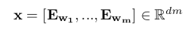
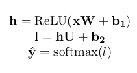
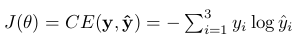

# neural_dependency_parsing
This code was adapted from an assignment for the Stanford class on Deep Learning for NLP. It builds a feed forward neural dependency parser using transition-based parsing. 

All code was written by me unless otherwise indicated. 

Network looks up an embedding for each word and concatenates them into a single input vector:

where E ∈ R |V |×d is an embedding matrix with each row E{_w} as the vector for a particular word w. We then
compute our prediction as:

where h is referred to as the hidden layer, l is referred to as the logits, ŷ is referred to as the predictions,
and ReLU(z) = max(z, 0)). 

Model is trained to minimize cross-entropy loss:

To compute the loss for the training set, we average this J(θ) across all training examples.